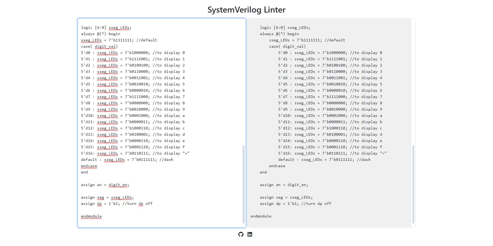

# SystemVerilog Linter and Formatter

Welcome to the repository for the SystemVerilog Code Linting and Formatting Tool. This tool is designed to enhance your SystemVerilog development workflow by ensuring your code is clean, consistent, and correctly formatted. Featuring a user-friendly HTML interface, it provides a straightforward way to format and tidy your SystemVerilog code directly in your browser.

## Quick Start

### Hosted Version
Access the linter and formatter instantly with no setup required through our [GitHub Pages site](https://verilog.alhassan.dev). Simply click the link, paste your code, and start linting and formatting!

### Local Usage
To run the tool locally:
1. Clone this repository or download the latest release.
2. Open `index.html` in your preferred web browser.
3. Paste or type your SystemVerilog code into the input area.
4. The tool will automatically format the code and display it in the output area, ready for copying or further editing.

## Features

This tool automates several aspects of code formatting to improve readability and maintainability of SystemVerilog files:

- **Indentation**: Automatically adjusts indentation levels according to nested block depth.
- **Comment Preservation**: Ensures that both inline and block comments are retained without alteration.
- **Module Formatting**: Handles indentation and formatting for module definitions, parameters, and I/O declarations.
- **Control Structures**: Formats control structures such as `if`, `else if`, `case`, `function`, and `task` for better clarity and structure.

## How It Works

The SystemVerilog Linter and Formatter parses the code inputted in the HTML interface, applying a set of predefined rules for indentation and formatting. The process is as follows:

- **Parse Input**: Read the code from the input area.
- **Apply Formatting Rules**: Execute formatting functions that organize and beautify the code.
- **Output Formatted Code**: Display the neatly formatted code in the output area for user review.

The tool is designed to work across all modern web browsers and integrates smoothly into any development setup.

## Roadmap

Future enhancements planned for the tool include:

- [ ] **Error Detection**: To catch and highlight syntax errors and common semantic issues.
- [ ] **Enhanced User Interface**: Revamping the interface to improve user experience and accessibility.
- [ ] **Customization Features**: Allowing users to set personal preferences for formatting rules.
- [ ] **Performance Improvements**: Optimizing algorithms to enhance speed and handle larger codebases more effectively.
- [ ] **IDE Integration**: Facilitating integration with popular IDEs like VSCode or Eclipse.
- [ ] **Expanded Documentation**: To include detailed examples, usage tips, and best practices.

## Contributing

We encourage contributions from the community! If you have suggestions for improvements, would like to report bugs, or want to contribute features, please feel free to fork the repository and submit a pull request.

## License

This project is made available under the [Apache License 2.0](LICENSE).
